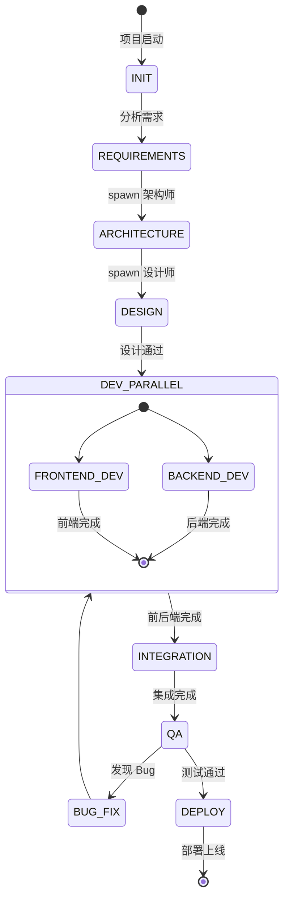

# EchoNote - Isolated Agents 团队架构 v2.0

**项目：** EchoNote 语音笔记应用  
**目标：** 全自动开发 + 端到端交付  
**架构：** Isolated Agents + 工作流引擎  

---

## 🎯 项目需求分析

### 技术栈
- **前端：** Next.js 14 + TypeScript + Tailwind CSS
- **后端：** Python FastAPI + PostgreSQL + Redis
- **AI：** Whisper (语音识别) + GPT/Claude (智能处理)
- **部署：** Vercel (前端) + Railway/Fly.io (后端)

### 核心功能
1. 语音录制与实时转录
2. AI 智能处理（摘要、标签、关键信息提取）
3. 笔记管理（列表、搜索、编辑）
4. 导出与分享

---

## 👥 Isolated Agents 团队配置

### 1. 产品经理 (PM) - Nova ⚡
**身份：** 我（当前 session）  
**职责：**
- 需求分析与拆解
- 工作流编排与调度
- Agent 间协调与通信
- 最终验收与决策

**配置：**
- Model: `zai/glm-5`
- Mode: 持久化 session
- 权限：可以 spawn 其他 agents，发送消息

---

### 2. 架构师 (Architect)
**职责：**
- 技术选型与系统架构设计
- API 契约定义（前后端接口规范）
- 数据库 Schema 设计
- 技术风险评估

**配置：**
- Model: `zai/glm-5` (强推理能力)
- Mode: `session` (持久化)
- Label: `echonote-architect`
- Workspace: 隔离
- 输入契约：PRD 需求文档
- 输出契约：
  - 架构设计文档 (Markdown)
  - API 规范 (OpenAPI 3.0)
  - 数据库 Schema (SQL)
  - 技术选型说明

**启动命令：**
```javascript
sessions_spawn({
  runtime: "acp",
  agentId: "architect",
  mode: "session",
  label: "echonote-architect",
  task: `你是 EchoNote 项目的架构师。

## 职责
- 设计系统架构（前后端分离）
- 定义 API 契约（RESTful）
- 设计数据库 Schema
- 技术选型建议

## 技术栈约束
- 前端：Next.js 14 + TypeScript + Tailwind
- 后端：Python FastAPI + PostgreSQL + Redis
- AI：Whisper API + GPT-4

## 工作流程
1. 等待我发送 PRD 文档
2. 输出架构设计文档
3. 根据反馈迭代

## 输出格式
使用 Markdown 格式，包含：
- 系统架构图（文本描述）
- API 接口列表
- 数据库表结构
- 技术决策说明`
})
```

---

### 3. UI/UX 设计师 (Designer)
**职责：**
- 界面设计（视觉 + 交互）
- 组件规范定义
- 原型设计

**配置：**
- Model: `kimi-coding/k2p5` (支持图片理解)
- Mode: `session`
- Label: `echonote-designer`
- Workspace: 隔离
- 输入契约：PRD + 架构文档
- 输出契约：
  - 设计规范文档 (Markdown)
  - 组件清单
  - 页面流程说明

**启动命令：**
```javascript
sessions_spawn({
  runtime: "acp",
  agentId: "designer",
  mode: "session",
  label: "echonote-designer",
  task: `你是 EchoNote 项目的 UI/UX 设计师。

## 职责
- 设计用户界面（移动端优先）
- 定义设计系统（颜色、字体、组件）
- 设计交互流程

## 设计原则
- 极简风格
- 3秒内开始录音
- AI 功能无缝融入

## 工作流程
1. 等待我发送 PRD 和架构文档
2. 输出设计规范
3. 根据反馈迭代

## 输出格式
使用 Markdown 格式，包含：
- 设计系统（颜色、字体、间距）
- 组件规范
- 页面流程说明`
})
```

---

### 4. 前端开发工程师 (Frontend Dev)
**职责：**
- Next.js 前端实现
- 组件开发
- 响应式适配
- 前端性能优化

**配置：**
- Model: `qwen3-coder-next` (代码特化)
- Mode: `session`
- Label: `echonote-frontend`
- Workspace: 隔离
- 输入契约：设计规范 + API 文档
- 输出契约：
  - 完整前端代码 (Next.js 项目)
  - README.md (运行说明)
  - 环境变量说明

**启动命令：**
```javascript
sessions_spawn({
  runtime: "acp",
  agentId: "frontend",
  mode: "session",
  label: "echonote-frontend",
  task: `你是 EchoNote 项目的前端开发工程师。

## 职责
- 实现 Next.js 前端应用
- 对接后端 API
- 实现响应式设计

## 技术栈
- Next.js 14 (App Router)
- TypeScript
- Tailwind CSS
- shadcn/ui

## 工作流程
1. 等待我发送设计规范和 API 文档
2. 实现前端代码
3. 发送代码给我
4. 根据反馈修复

## 输出格式
- 完整项目代码
- README.md (包含运行命令)
- .env.example`
})
```

---

### 5. 后端开发工程师 (Backend Dev)
**职责：**
- FastAPI 后端实现
- 数据库设计与实现
- API 开发
- 业务逻辑实现
- AI 集成（Whisper + GPT）

**配置：**
- Model: `zai/glm-5` (编程 SOTA)
- Mode: `session`
- Label: `echonote-backend`
- Workspace: 隔离
- 输入契约：架构文档 + API 契约
- 输出契约：
  - 完整后端代码 (FastAPI 项目)
  - API 文档 (OpenAPI/Swagger)
  - 数据库迁移脚本
  - README.md (运行说明)

**启动命令：**
```javascript
sessions_spawn({
  runtime: "acp",
  agentId: "backend",
  mode: "session",
  label: "echonote-backend",
  task: `你是 EchoNote 项目的后端开发工程师。

## 职责
- 实现 FastAPI 后端应用
- 设计和实现数据库
- 开发 RESTful API
- 集成 Whisper 和 GPT

## 技术栈
- Python FastAPI
- PostgreSQL + Redis
- Whisper API (语音识别)
- OpenAI API (智能处理)

## 工作流程
1. 等待我发送架构文档和 API 契约
2. 实现后端代码
3. 发送代码和 API 文档给我
4. 根据反馈修复

## 输出格式
- 完整项目代码
- API 文档 (OpenAPI 格式)
- database.sql (数据库 Schema)
- README.md`
})
```

---

### 6. DevOps 工程师 (DevOps)
**职责：**
- CI/CD 流程设计
- Docker 容器化
- 部署脚本
- 环境配置管理

**配置：**
- Model: `qwen3-coder-next`
- Mode: `session`
- Label: `echonote-devops`
- Workspace: 隔离
- 输入契约：前后端代码
- 输出契约：
  - Dockerfile
  - docker-compose.yml
  - CI/CD 配置 (GitHub Actions)
  - 部署文档

**启动命令：**
```javascript
sessions_spawn({
  runtime: "acp",
  agentId: "devops",
  mode: "session",
  label: "echonote-devops",
  task: `你是 EchoNote 项目的 DevOps 工程师。

## 职责
- 容器化应用
- 设计 CI/CD 流程
- 编写部署脚本
- 环境配置管理

## 部署目标
- 前端：Vercel
- 后端：Railway/Fly.io
- 数据库：Supabase

## 工作流程
1. 等待我发送前后端代码
2. 输出部署配置
3. 根据反馈调整

## 输出格式
- Dockerfile (前后端)
- docker-compose.yml
- .github/workflows/ci.yml
- deploy.md (部署文档)`
})
```

---

### 7. QA 工程师 (QA Engineer)
**职责：**
- 测试用例设计
- 功能测试
- 性能测试
- Bug 报告

**配置：**
- Model: `kimi-coding/k2p5`
- Mode: `session`
- Label: `echonote-qa`
- Workspace: 隔离
- 输入契约：前后端代码 + API 文档
- 输出契约：
  - 测试用例文档
  - 测试报告
  - Bug 列表

**启动命令：**
```javascript
sessions_spawn({
  runtime: "acp",
  agentId: "qa",
  mode: "session",
  label: "echonote-qa",
  task: `你是 EchoNote 项目的 QA 工程师。

## 职责
- 设计测试用例
- 执行功能测试
- 性能测试
- 编写测试报告

## 测试范围
- 前端 UI 测试
- API 接口测试
- 端到端测试
- 性能测试

## 工作流程
1. 等待我发送代码和 API 文档
2. 执行测试
3. 输出测试报告
4. Bug 修复验证

## 输出格式
- test-cases.md (测试用例)
- test-report.md (测试报告)
- bugs.md (Bug 列表)`
})
```

---

## 🔄 工作流引擎设计

### 状态机定义



### 阶段定义

| 阶段 | 状态 | 触发条件 | 负责人 | 交付物 |
|------|------|---------|--------|--------|
| **需求分析** | REQUIREMENTS | 项目启动 | PM (我) | PRD.md |
| **架构设计** | ARCHITECTURE | PRD 完成 | Architect | 架构文档 + API 契约 |
| **UI/UX 设计** | DESIGN | 架构完成 | Designer | 设计规范 |
| **前端开发** | FRONTEND_DEV | 设计完成 | Frontend Dev | 前端代码 |
| **后端开发** | BACKEND_DEV | 架构完成 | Backend Dev | 后端代码 + API |
| **集成** | INTEGRATION | 前后端完成 | PM (我) | 集成报告 |
| **测试** | QA | 集成完成 | QA Engineer | 测试报告 |
| **部署** | DEPLOY | 测试通过 | DevOps | 部署文档 |

---

## 📋 任务流转协议

### 消息格式规范

```typescript
interface AgentMessage {
  type: "task_assignment" | "deliverable" | "feedback" | "status_update" | "question";
  from: string;  // agent label
  to: string;    // agent label or "pm"
  taskId: string;
  payload: {
    content: string;
    artifacts?: string[];  // file paths or URLs
    status?: "pending" | "in_progress" | "completed" | "blocked";
    priority?: "low" | "medium" | "high";
  };
  timestamp: string;
}
```

### 任务分配示例

**PM → Architect:**
```javascript
sessions_send({
  sessionKey: "agent:main:echonote-architect",
  message: `【任务分配】EchoNote 架构设计

## 需求文档
{{prd_content}}

## 技术约束
- 前端：Next.js 14 + TypeScript
- 后端：Python FastAPI
- 数据库：PostgreSQL + Redis

## 交付要求
1. 系统架构文档 (Markdown)
2. API 契约 (OpenAPI 3.0)
3. 数据库 Schema (SQL)
4. 技术选型说明

## 截止时间
请在 2 小时内完成，发送给我 review。

Task ID: T1-Architecture`
})
```

**Architect → PM:**
```javascript
sessions_send({
  sessionKey: "agent:main:main",  // 发送给我
  message: `【交付物】EchoNote 架构设计完成

## 架构文档
{{architecture_content}}

## API 契约
{{api_spec}}

## 数据库 Schema
{{database_schema}}

## 待决策事项
1. 语音识别使用 Whisper API 还是本地部署？
2. 是否需要实时协作功能？

Task ID: T1-Architecture
Status: completed`
})
```

---

## 🚀 实施计划

### Step 1: 启动 Agent 团队（今天）
- [x] 设计架构文档
- [ ] Spawn Architect
- [ ] Spawn Designer
- [ ] Spawn Frontend Dev
- [ ] Spawn Backend Dev
- [ ] Spawn DevOps
- [ ] Spawn QA

### Step 2: 启动工作流（明天）
- [ ] 发送 PRD 给 Architect
- [ ] 等待架构设计完成
- [ ] 发送架构文档给 Designer
- [ ] 等待设计完成
- [ ] 并行启动前后端开发

### Step 3: 集成与测试（后天）
- [ ] 前后端集成
- [ ] QA 测试
- [ ] Bug 修复
- [ ] 部署上线

---

## ⚠️ 风险管理

| 风险 | 概率 | 影响 | 应对策略 |
|------|------|------|---------|
| Agent 无响应 | 中 | 高 | 设置超时（30min），自动重启 |
| 输出质量差 | 高 | 高 | 明确验收标准，增加 review 环节 |
| 沟通开销大 | 中 | 中 | 批量消息，异步协作 |
| Context 爆炸 | 低 | 高 | 定期总结，清理历史 |
| API 契约不一致 | 高 | 高 | 架构师统一审核，自动化测试 |

---

## 📊 成功指标

| 指标 | 目标 | 测量方式 |
|------|------|---------|
| **端到端时间** | < 3 天 | 从启动到部署 |
| **代码质量** | 无严重 Bug | QA 测试报告 |
| **API 一致性** | 100% | 自动化测试 |
| **文档完整性** | 100% | Checklist |

---

## 🎯 下一步行动

1. **你确认这个架构吗？** 需要调整哪些 Agent 角色？
2. **立即启动团队？** 我可以开始 spawn 所有 Agents
3. **还是先试点？** 先启动 Architect + Designer，验证流程

**你的决策？** ⚡
